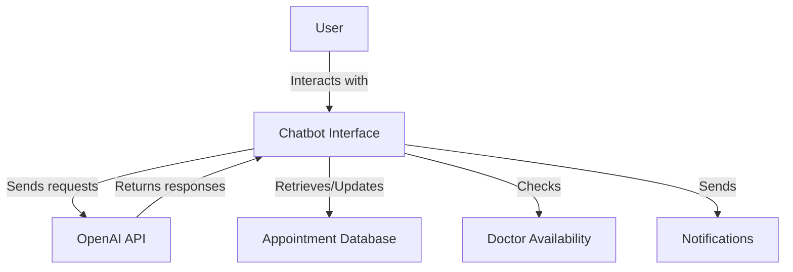

# 🤖 AI-Powered Appointment Scheduling Assistant

## 📚 Table of Contents
1. [Introduction](#introduction)
2. [Problem Statement](#problem-statement)
3. [Features](#features)
4. [Technologies Used](#technologies-used)
5. [Installation](#installation)
6. [Usage](#usage)
7. [Project Structure](#project-structure)
8. [Architecture](#architecture)
9. [API Reference](#api-reference)
10. [Testing](#testing)
11. [Deployment](#deployment)
12. [Contributing](#contributing)
13. [License](#license)
14. [Acknowledgements](#acknowledgements)

## 🎉 Introduction

The AI-Powered Appointment Scheduling Assistant is an advanced chatbot system designed to streamline the process of scheduling medical appointments. It leverages natural language processing and machine learning to provide a seamless, efficient, and patient-centric scheduling experience for healthcare facilities.

## 🎯 Problem Statement

The current process of scheduling and managing medical appointments presents challenges for both patients and healthcare providers. Inefficiencies in the existing system can lead to suboptimal experiences and resource allocation. This project aims to address these issues by providing an AI-powered solution that enhances the appointment booking process.

For a detailed problem statement, please refer to the [PROBLEM_STATEMENT.md](task/PROBLEM_STATEMENT.md) file.

## ✨ Features

- 🗣️ Natural language processing for conversational interactions
- 📊 Dynamic information gathering from patients
- 🕒 Real-time availability checking for doctors and specialties
- 🚑 Intelligent routing for urgent cases
- 🌐 Multilingual support
- 🔒 HIPAA-compliant data handling
- 📅 Appointment confirmation and instructions
- 🚗 Integration with additional services (e.g., parking information, pre-appointment tests)
- 🔔 Automated reminder system
- 📈 Feedback collection for continuous improvement

## 🛠️ Technologies Used

- Python 3.x
- OpenAI GPT-4 API
- JSON for data structuring
- Rich library for console output formatting
- Colorama for colored terminal output


## 🚀 Usage

To start the AI-powered appointment scheduling assistant, run:

```
python llm-scheduling/chatbot.py
```

Follow the on-screen prompts to interact with the chatbot and schedule appointments.

## 📁 Project Structure

| File Name | Type | Description |
|-----------|------|-------------|
| llm-scheduling/chatbot.py | Python | Main chatbot script |
| task/ARCHITECTURE.md | Markdown | System architecture documentation |
| task/PROBLEM_STATEMENT.md | Markdown | Problem statement and solution overview |
| task/01-protocol.md | Markdown | Operating procedure protocol for appointment scheduling |
| task/prompt.md | Markdown | AI assistant prompt and guidelines |
| task/sample.json | JSON | Sample JSON structure for appointment data |

## 🏗️ Architecture

The system architecture is documented in detail in the [ARCHITECTURE.md](task/ARCHITECTURE.md) file. Here's a high-level overview of the system:



## 🔌 API Reference

The project uses the OpenAI GPT-4 API for natural language processing. For detailed information on the API usage, please refer to the [OpenAI API documentation](https://beta.openai.com/docs/).


## 📄 License

This project is licensed under the MIT License. See the [LICENSE](LICENSE) file for details.

## 👏 Acknowledgements

- OpenAI for providing the GPT-4 API
- Contributors and maintainers of the open-source libraries used in this project
- Healthcare professionals who provided valuable insights into the appointment scheduling process
