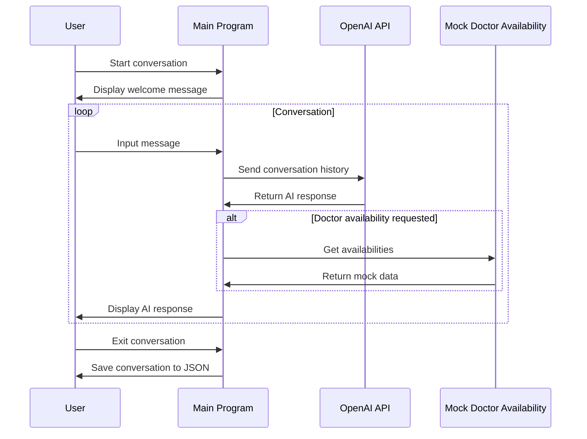
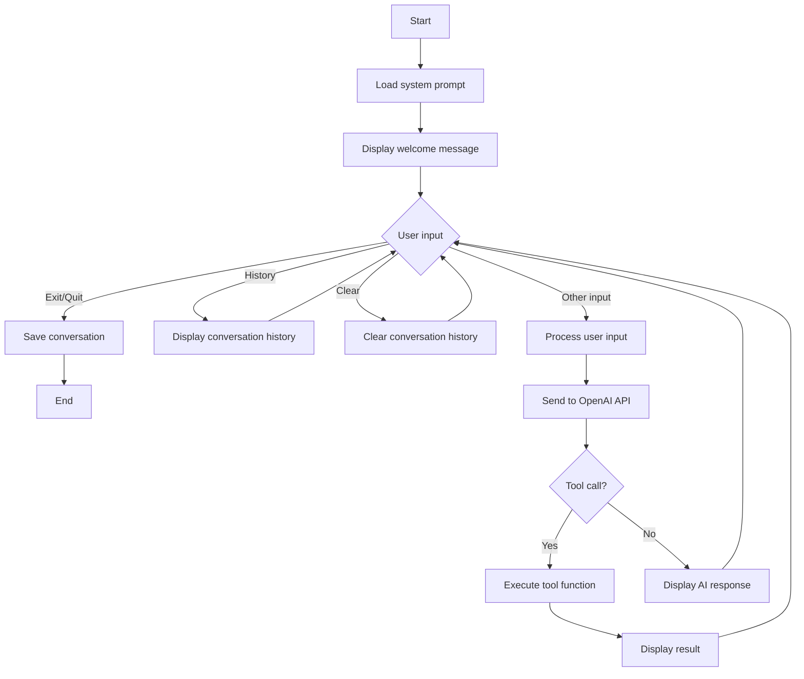
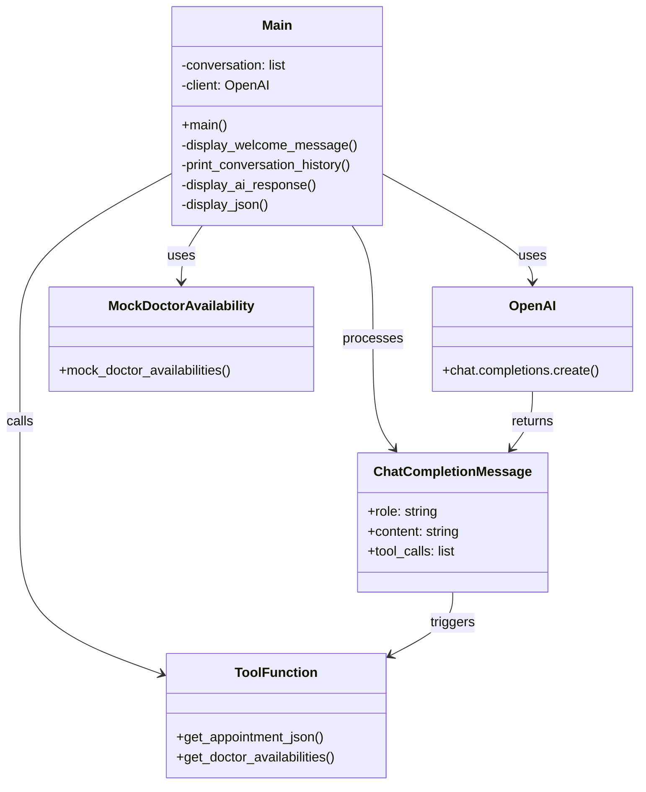
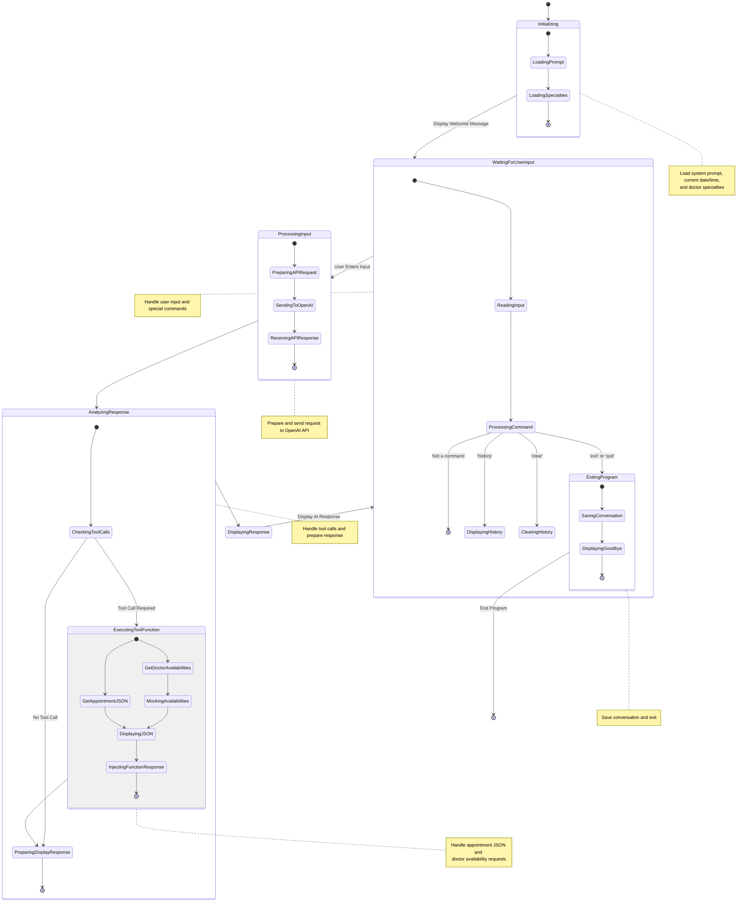

## 1. Sequence Diagram

This diagram shows the interaction between the user, the main program, OpenAI API, and the mock doctor availability function.

## 2. Flowchart

This flowchart illustrates the main program's logic and decision-making process.

## 3. Class Diagram

This class diagram shows the main components and their relationships in the system.

## 3. State Diagram

